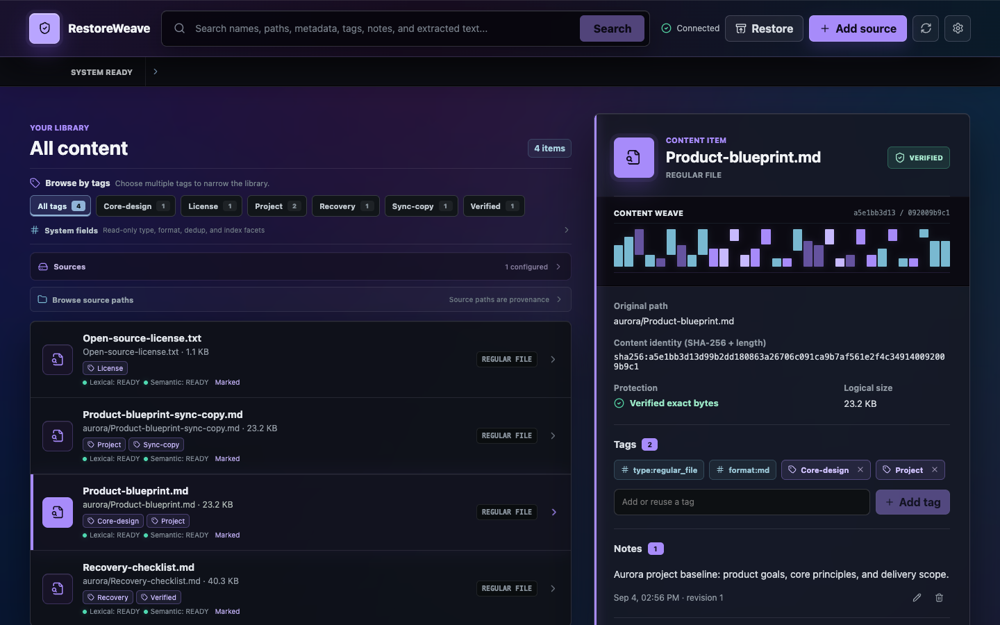
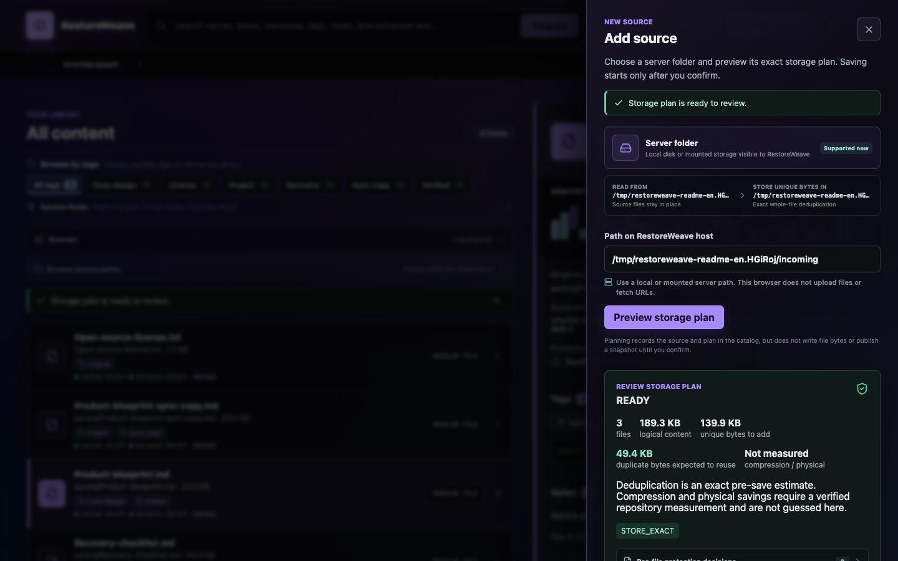

# RestoreWeave

[中文](README.md) | [English](README.en.md)

**Self-hosted content protection, discovery, and recovery for NAS and heterogeneous data.**

**Store fewer duplicate bytes. Find content more easily. Restore with proof.**

For a short tour of the workflow and current boundaries, see the [RestoreWeave Wiki](docs/wiki/README.md). The detailed requirements and ADRs linked from [docs/README.md](docs/README.md) remain authoritative.

> Current `main`: an unreleased core preview after `v0.1.0-prealpha.1`. The tested workflow is “configure → preview → exact save and whole-file dedup → lexical/optional BGE search → multiple tags and Notes → exact restore.” This is not a production release: LinkGroup, supported installers, production repository qualification, and complete multi-platform guarantees remain open.



_A real running WebUI populated only with sanitized demo data built from this repository's documents._

## Start the WebUI in 5 minutes

Use Go 1.26 (or the version declared by `go.mod`) and a Node.js version supported by Vite 7:

```bash
git clone https://github.com/ailiheizi/restoreweave.git
cd restoreweave

go build -tags=purego -o bin/restoreweaved ./server/cmd/restoreweaved
go build -o bin/rw ./client/cmd/rw
bin/rw config init --path ./restoreweave.toml
```

Enable the local API in the generated config:

```toml
[api]
enabled = true
listen = "127.0.0.1:4534"
```

Start the daemon and development frontend in separate terminals:

```bash
# Terminal 1
bin/restoreweaved --config ./restoreweave.toml --socket /tmp/restoreweaved.sock

# Terminal 2
cd web
npm ci
npm run dev
```

Open `http://127.0.0.1:5173/`. The API is currently a loopback convenience adapter; do not expose it directly to the public network. Remote deployment still requires TLS, authentication, authorization, audit, and separate qualification.

## What the core is

RestoreWeave is not a cloud-drive filesystem, OpenList fork, media server, or a thin copy of a backup tool. It owns one complete data-management loop:

```text
configure storage locations
-> inspect a source to add to the content library
-> approve a storage plan
-> retain exact content and recoverable metadata
-> add Notes (including descriptive information)
-> find content with ordinary filters and semantic search
-> save a view and freeze an export manifest
-> verify, export, or restore the original bytes
```

Three invariants define the core:

1. **Identical bytes need only one stored object.** Exact identity is the full-content SHA-256 plus logical length. A filename, path, similarity score, embedding, or model output can never declare two files identical.
2. **Search data is rebuildable.** Lexical and embedding indexes are projections. Removing them temporarily degrades search; it does not remove files, Notes, provenance records, or recovery authority.
3. **Recovery does not depend on AI.** Even if the model, vector index, and live SQLite catalog are unavailable, a clean reader can authenticate and restore exact bytes when the repository, authenticated recovery records, and independently retained trust anchor remain intact.

## What works now

The list below is organized around user-visible work. Except where marked as a candidate, these capabilities have implementation and automated test evidence. “Implemented and tested” does not mean “production-qualified.”

### Configuration and status

- Persisted TOML configuration, with read compatibility for older YAML profiles.
- Explicit catalog, repository, vector, model, and publication-signing-material locations.
- Relative paths resolve against the config file, never an accidental daemon working directory.
- The config CLI provides separate `rw config init --path <file>`, `rw config validate --path <file>`, and `rw config show --path <file> --effective` commands; the daemon uses `restoreweaved --config <file>`, with environment overrides also available.
- A configuration digest bound to plans, snapshots, Descriptions, and index/semantic generations.
- Status and diagnostics for the daemon, catalog, repository, indexes, plans, jobs, and providers.

### Inspect, plan, and protect

- Read-only traversal of local or already-mounted directories.
- Capture of names, original paths, types, sizes, timestamps, symlinks, hard links, detection evidence, platform-observable xattr/ACL state, and sparse indication.
- Changed, unreadable, out-of-boundary, or unstable entries become visible blockers instead of fabricated successes.
- A non-mutating protection plan reports file count, logical size, expected new storage, and per-entry outcomes; already-stored or duplicate content appears as reduced `new_bytes`.
- After a successful save, the WebUI reports actual new payload bytes and compression savings from that save's verified placement receipts. This is not whole-repository net savings, and an unprovable placement outcome remains explicitly unmeasured.
- Placement begins only after the plan ID and digest are approved. Reapplying the same plan replays the same logical result.
- `STORE_EXACT` is the default.
- Advanced CLI flows can explicitly retain `LINK_ONLY`, `METADATA_ONLY`, and external locator records. Their unprotected or unavailable state remains visible and is never reported as exact protection.
- Derived processing failures do not block exact preservation of readable files; they produce explicit fallback or degraded outcomes.

### SHA-256 identity and whole-file deduplication

- Streaming SHA-256 over the complete logical file, with logical length included in identity.
- Byte-identical files under different names or paths reuse one content object.
- Each original name, path, and metadata record remains distinct, so deduplication does not destroy directory recovery.
- Protection preview separates logical bytes from bytes that actually need new repository placement.
- Exact whole-file deduplication is the current default. Chunk deduplication is not presented as an existing feature or a core-completion requirement.



_The preview records a plan but writes no file bytes; duplicate savings are an exact pre-save estimate._

### Notes, tags, and extracted information

- Multiple editable, revisioned Notes can be attached to one file.
- Notes feed both ordinary and semantic search directly, without copying them into a hidden second record.
- A content item may have multiple durable tags. The WebUI can create, reuse, and remove tags, with suggestions drawn from tag values already used in the workspace.
- Format and type appear as deterministic system tags/facets rather than pretending to be user tags. Future AI classification must be previewed and confirmed and cannot silently replace manual tags.
- The default library is content-first. Original directories remain provenance and a recovery projection under the secondary source-path browser, not the primary organization.
- User-authored, imported, extracted, and model-produced text appears in the same Notes surface, with source, producer, or editability labels where relevant.
- The backend still retains revisioned description records with source, language, producer, predecessor revision, and semantic segments for search, recovery, and audit; this is not a second user-facing concept.
- The default build does not bundle an AI description generator. Generation can run on demand only after an admitted provider is explicitly configured; ingest never triggers it automatically.
- Basic built-in extraction covers UTF-8 text, ID3/FLAC/OGG audio tags, and EPUB OPF metadata.
- Processor results carry provenance. Failure, timeout, or unavailability never grants content-identity or recovery authority.

### Lexical, structured, and semantic search

- Search filename, original path, suffix, type, tags, Notes (including sourced text), and extracted text.
- Filter by entry type, size, mtime, SHA-256, duplicate group, `protection_mode`, language, and suffix.
- Lexical, structured, and semantic results resolve to the same stable subject.
- Results preserve the matched Notes content or extracted-text segment and its source, not just an opaque score.
- With an explicitly provisioned and verified platform bundle, real local semantic vector generation and query using `BAAI/bge-small-zh-v1.5`, ONNX Runtime, and in-process zvec.
- A real inference probe runs at daemon startup, and a compatible zvec generation can reopen after restart.
- An unhealthy model, lease, or generation reports semantic search unavailable while lexical/structured search, exact protection, and recovery continue.
- Every semantic generation is strictly bound to its embedding profile and configuration. Incompatible generations fail closed without rewriting old durable Notes/description records or subject identity.

### Browse and bounded exact reads

- List the original-path projection, resolve a path to a subject, and inspect file, directory, and symlink facts.
- List exact and derived representations available for a subject.
- Read exact content or byte ranges through handles with bounds, expiry, and size limits.
- Neither search nor private repository layout replaces the original-path recovery projection.

### Snapshots, SavedViews, and exports

- List snapshots and compare added, removed, moved, content, metadata, and type changes between snapshots.
- Save a dynamic `SavedView` and reevaluate the same query later.
- Freeze one view evaluation into an immutable `ExportManifest`.
- Materialize the frozen manifest to an explicit destination and verify every path, length, and SHA-256.
- Reapplying one manifest is idempotent; non-empty destinations and symlink attacks fail closed.
- The view/export path passes local end-to-end tests, but is not release-qualified yet.

### Verification, restore, and disaster reading

- Authenticated-metadata, sampled-content, full-bytes, restore-drill, and clean-recovery verification modes.
- Restore also begins with a read-only plan. Approval writes only to a new empty directory, then validates the final path set, lengths, and SHA-256 values.
- Export authenticated recovery references, recovery tokens, and an independently retained public trust anchor.
- Discover, verify, and restore snapshots in a clean-install reader without the live SQLite catalog, search indexes, or signing private key.
- Reject modified, truncated, missing, incorrectly signed, wrong-anchor, or reader-incompatible recovery records and content.
- Read-only verification after repository relocation, plus tested raw/zstd copy-forward migration, target-tamper rejection, and preservation of the old repository as rollback authority.
- Cross-process publication fencing prevents two daemons from interleaving publication. Authenticated records reconcile unknown outcomes.
- The daemon automatically performs bounded retries of the same signed processor plan with lease, fencing, idempotency, restart-resume, unknown-outcome reconciliation, and retry-limit evidence. Arbitrary user-triggered or rerouted reprocessing remains unavailable.

### Interfaces

- **WebUI:** service and storage status, content-first and source-path browsing, storage preview/confirmation, search, path/SHA/storage details, multiple tags and Notes, and whole-snapshot restore preview/confirmation.
- **CLI:** initialization, diagnostics, scripts, the complete plan/snapshot/view/export surface, and emergency recovery. It is not intended to remain the required daily interface.
- **MCP:** local read-only stdio access for inspection, search, namespace, representation, annotation, and metadata operations.
- **API:** currently only loopback `GET /api/v1/healthz` and typed `POST /api/v1/command`, sharing the same dispatcher with optional bearer-token validation. It is not a complete public-network REST platform.

## One complete workflow

### WebUI

```text
open Add content
-> enter a directory visible to the server
-> Preview protection
-> review file count, logical size, new storage, and blockers
-> Confirm protection
-> search and add multiple Notes
-> run a descriptive BGE semantic query
-> inspect SHA-256 and protection state
-> configure storage paths, local BGE/online replacement profiles, recovery, and service options in Settings
-> validate and atomically update the same TOML profile, with an explicit restart notice when required
-> Preview restore
-> restore to a new empty directory and verify
```

### CLI

```bash
# Initialize and start
go build -tags=purego -o bin/restoreweaved ./server/cmd/restoreweaved
go build -o bin/rw ./client/cmd/rw
bin/rw config init --path ./restoreweave.toml
bin/restoreweaved --config ./restoreweave.toml --socket /tmp/restoreweaved.sock

# Inspect a directory; the command prints the matching plan-apply arguments
bin/rw --socket /tmp/restoreweaved.sock ingest /path/to/directory
bin/rw --socket /tmp/restoreweaved.sock plan apply <plan-id> \
  --workspace <workspace-id> --digest <plan-digest>

# Search and inspect snapshots
bin/rw --socket /tmp/restoreweaved.sock search "documents needed after a disaster" \
  --workspace <workspace-id>
bin/rw --socket /tmp/restoreweaved.sock snapshot list

# Restore also creates a plan before execution
bin/rw --socket /tmp/restoreweaved.sock restore <snapshot-ref> /path/to/empty-destination
bin/rw --socket /tmp/restoreweaved.sock plan apply <restore-plan-id> \
  --workspace <workspace-id> --digest <restore-plan-digest>
```

## Where data lives

RestoreWeave keeps the number of physical entities small, while giving each one a distinct responsibility:

| Data | Default shape | Rebuildable? | Purpose |
| --- | --- | --- | --- |
| Configuration | `config.toml` | Not inferable from content | Selects every location and profile |
| Catalog | One SQLite file | Partly recoverable from authenticated records | Subjects, paths, facts, Notes and backend description records, plans, and state |
| Content repository | Configured repository directory | Not rebuildable from indexes | Original exact bytes and authenticated records |
| Lexical index | Separate SQLite FTS generation | Yes | Text and structured search |
| Semantic index | zvec generation | Yes | BGE embedding search |
| Portable recovery records | Authenticated records in the repository plus an explicitly exported recovery reference | Not replaceable by an empty index | Catalog-free verification and restore |
| Publication signing material | `paths.recovery_records` | No | Publication private key and local anchor copy; not a clean-reader artifact |
| Trust anchor | Exported and retained independently | Not inferable from an untrusted repository | Signature verification for recovery records |

Catalog, repository, and index are separate logical layers; they do not require three database services. The personal profile uses local SQLite, a directory repository, and in-process zvec, with no Qdrant, Milvus, or Docker Compose dependency.

## What happens when data is removed or lost

| Missing data | Result |
| --- | --- |
| Lexical/zvec indexes removed | Search degrades; files, Notes, provenance records, and recovery remain, and indexes can rebuild |
| BGE/ONNX/zvec bundle unavailable | Semantic search is unavailable; lexical search, protection, verification, and restore continue |
| SQLite catalog unavailable | Daily search and editing are unavailable; a clean reader can still verify and restore when the repository, exported recovery reference, and independent trust anchor remain |
| Repository payload missing | Recovery records cannot recreate source bytes from nothing; the affected content is not restorable |
| Catalog and portable recovery records both missing | Context-free blobs are insufficient to safely reconstruct the original namespace and recovery meaning |
| Publication signing material missing | Existing exported recovery references remain clean-reader verifiable; the ordinary daemon cannot continue the original signed publication lineage |
| Independent trust anchor missing | Signed recovery records cannot be authenticated as designed; do not keep the only copy in the same failure domain |
| Experimental encrypted-repository key missing | Encrypted content is unreadable; this profile is neither the generated default nor a production capability |

## Current status

| Capability | Status |
| --- | --- |
| Config, scan, plans, SHA-256 identity, whole-file dedup, exact protection | Implemented and tested for the development profile |
| Notes presentation, backend description records, and lexical/structured search | Implemented and tested for the stated field scope |
| BGE-small-zh + ONNX + zvec | Implemented and tested with an explicitly provisioned real bundle; a verifiable candidate offline assembler exists, but no supported package does |
| Signed recovery, clean reader, tamper rejection, fencing, reconciliation | Implemented and tested for the admitted development profile |
| SavedView, ExportManifest, materialize/verify | Implemented and tested for local scope; not release-qualified |
| React WebUI and loopback API | Usable core convenience surface; not a remote administration platform |
| `directory-cas-dev-v1` | Current generated development default; not a release default |
| `local-zstd-v1` | Runnable candidate with tested whole-file compression, dedup, verification, repair, and migration; not qualified |
| `local-zstd-encrypted-v1` | Experimental candidate with tested AES-256-GCM and external KeyProvider behavior; not a config default |
| GC | `NON_DESTRUCTIVE_ONLY` reachability planning; no deletion executor |
| `RW-MVP-1` | Not complete or release-qualified |

## BGE model

The personal profile selects `BAAI/bge-small-zh-v1.5`. The model, ONNX Runtime, and native zvec bundle are never downloaded silently at daemon startup or on the first query. You can explicitly invoke the fixed development installer from Settings or the CLI, or import a retained offline bundle archive. The installer verifies the pinned digests and atomically publishes the bundle under:

```text
<paths.models>/bge-small-zh-v1.5/<goos>-<goarch>/
```

Example default location for Darwin ARM64:

```text
~/.local/share/restoreweave/models/bge-small-zh-v1.5/darwin-arm64/
```

The online development entry point is `rw semantic bundle install`; the offline entry point is `rw semantic bundle install --archive /absolute/path/to/bundle.tar.gz`. You can also pass the daemon an operator-provided bundle with `--semantic-bundle`. Without a bundle, the daemon honestly reports semantic search unavailable; it never substitutes fixture vectors for a real model. The installer and CLI path have automated coverage; Settings remains a development convenience and does not yet carry complete browser install, restart, and real-query release evidence.

Developers may use `scripts/package-offline.sh` to combine prebuilt daemon,
CLI, `web/dist`, and an offline semantic archive into one candidate `.tar.gz`
with per-file SHA-256 values, the MIT license, and separated third-party
NOTICE/SBOM evidence. The artifact is explicitly marked
`CANDIDATE_ONLY_NOT_SUPPORTED`; it is not a supported installer and does not
replace Linux/NAS clean-host qualification.

The script rejects daemons without the exact `-tags=purego` build, without the
pinned zvec-go version or module sum, or whose GOOS/GOARCH differs from the
artifact platform labels. This prevents fixture or semantic-unavailable builds
from being presented as a real in-process-zvec candidate.

When building the daemon from source today, keep the `-tags=purego` flag shown above so the real zvec backend is compiled in. A development build without that tag contains only the explicitly unavailable placeholder. A future supported package should ship the correct variant without exposing build tags to users.

The model, ONNX Runtime, zvec, and Go binding each retain their own license, NOTICE/SBOM, and redistribution obligations. A future install bundle must preserve and qualify them separately; they are not covered automatically by this repository's MIT License.

## What comes next

Near-term work is limited to turning the existing core into a releasable product:

1. **Background-worker release acceptance:** the bounded same-plan retry worker is implemented and tested; target release hosts still need resource, upgrade, and long-running acceptance. User-triggered, rerouted, or general reprocessing still requires a separate signed successor contract.
2. **Offline packaging:** package the daemon, WebUI, ONNX Runtime, BGE model/tokenizer, and zvec without first-query downloads.
3. **Production repository qualification:** use representative corpora to select one lossless repository profile and fully test encryption, corruption, repair, relocation, migration, rollback, clean reading, and real net savings.
4. **Complete daily experience:** expose SavedViews, ExportManifests, backup/upgrade/recovery guidance in the WebUI, and remove internal IDs from those ordinary workflows.
5. **Release qualification:** measure search coverage, semantic latency, storage growth, recovery time, upgrade/rollback, and clean-install behavior on Linux and NAS-like corpora.

Longer-term options enter the core queue only when concrete demand exists: reviewed source migration and capacity release, more extractors/OCR/ASR/CLIP, alternate embedding or repository profiles, multiple repositories and tiering, and enterprise remote management, RBAC, and HA. RWKV/Transformer compression can only be a future explicit research profile that is reversible, migratable, and has a safe fallback.

## Explicit non-goals

- Built-in FUSE, SMB, NFS, WebDAV, or S3 gateways.
- An OpenList fork or OpenList as a core dependency.
- Built-in players, readers, or media servers.
- Automatic external reacquisition, automatic source deletion, or destructive GC.
- Embeddings, similarity, filenames, or model output as exact identity or deletion authority.
- Qdrant, Milvus, or Docker Compose as personal-profile dependencies.
- Neural codecs before simple lossless storage and complete recovery are qualified.

## Verification

```bash
go test ./... -count=1
go test -race ./server/internal/store/sqlite ./server/internal/exact \
  ./server/internal/processor ./server/internal/search \
  ./server/controlplane ./server/cmd/restoreweaved -count=1
go vet ./...
go mod verify

cd web
npm ci
npm run build
```

The repository contains hundreds of Go test entry points, including real daemon/CLI, semantic-bundle, index-rebuild, recovery, tamper, migration, and cross-process scenarios. The tests prove their declared scope; they do not imply support for every platform or production environment.

## Documentation and license

- [中文 README](README.md)
- [Documentation map](docs/README.md)
- [MVP and operator contract](docs/requirements/mvp-and-operator-contract.md)
- [Content, dedup, discovery, view/export, and GC contract](docs/requirements/content-store-views-and-exports.md)
- [Core execution order](docs/technical/core-mvp-execution-plan.md)
- [API and WebUI boundary](docs/requirements/api-and-webui.md)
- [Release qualification](docs/requirements/release-qualification-and-traceability.md)
- [Changelog](CHANGELOG.md)
- [MIT License](LICENSE)

RestoreWeave project source is licensed under the [MIT License](LICENSE). Third-party dependencies, model weights, tokenizers, datasets, and future install bundles remain subject to their own licenses and redistribution terms.
