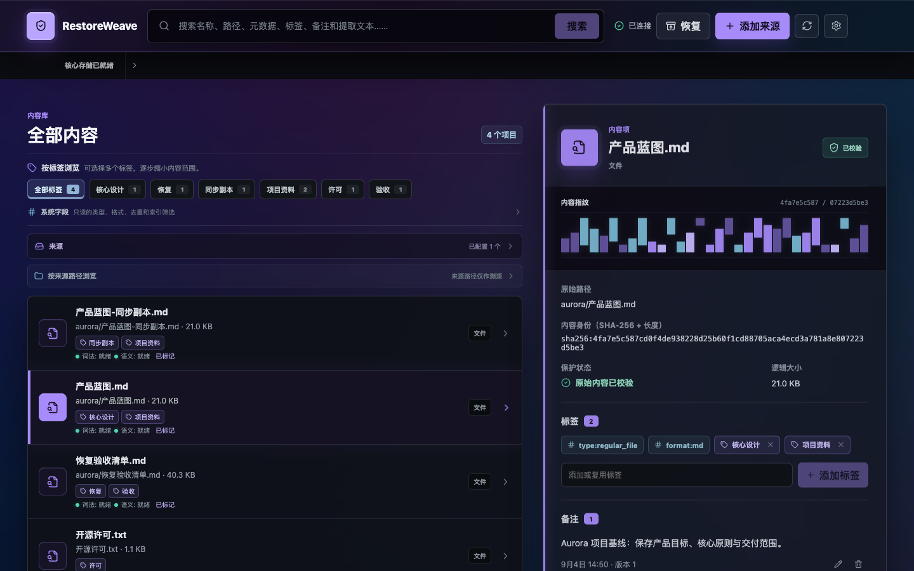
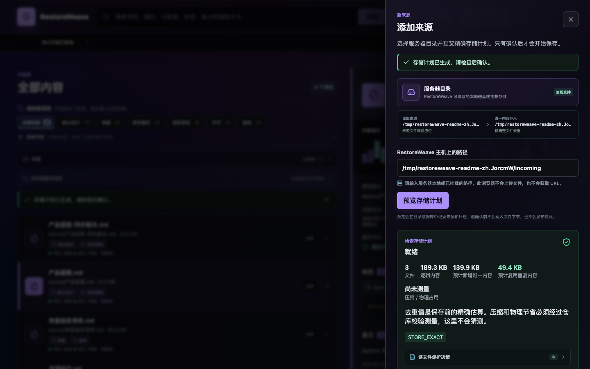

# RestoreWeave

[中文](README.md) · [English](README.en.md)

<p align="center">
  <strong>面向 NAS 与异构数据的自托管内容感知存储、发现与恢复层</strong><br>
  少存重复内容，更容易找到，并且能可靠恢复。
</p>

<p align="center">
  <a href="#当前状态"></a>
  <a href="LICENSE"></a>
  <a href="go.mod"></a>
</p>

> 当前 `main` 是 `v0.1.0-prealpha.1` 之后的未发行 core preview。开发配置已经实测跑通“配置 → 预览 → 精确保存与整文件去重 → 关键词/可选 BGE 搜索 → 多标签与 Notes → 精确恢复”。这不是生产发行版；正式安装包、生产仓库资格、LinkGroup 和完整多平台发行保证仍在后续阶段。

<p align="center">
  
</p>
<p align="center"><sub>真实运行中的 WebUI，使用仓库文档构造的脱敏演示数据。</sub></p>

[5 分钟启动](#5-分钟启动) · [核心能力](#核心能力) · [Wiki](docs/wiki/README.md) · [完整文档](docs/README.md) · [变更记录](CHANGELOG.md)

## 核心能力

- **精确保存与去重**：以完整内容的 SHA-256 加逻辑长度作为身份；字节相同的文件只保存一份，文件名和原始路径仍可分别恢复。
- **先看再保存**：先生成只读计划，显示文件数、逻辑大小、预计新增空间、重复内容和阻塞项，确认后才写入。
- **方便找到**：关键词、结构化条件、标签和 Notes 可以一起搜索；显式安装并校验本地 BGE bundle 后，还可使用语义搜索。
- **保留上下文**：原始名称、路径、文件事实、多个标签和一个 Notes 界面都会保留；系统类型/格式筛选不会冒充用户标签。
- **可靠恢复**：导出和恢复会再次校验路径、长度与 SHA-256。搜索索引或模型不可用时，精确内容仍可读、可恢复。

RestoreWeave 是内容管理、发现、导出和恢复层，不是网盘文件系统、挂载服务、媒体服务器或 OpenList fork。原始目录是来源证明和恢复投影，日常组织以内容、标签、Notes、搜索和保存的视图为主。

## 一次使用流程

```text
配置存储位置
→ 检查要加入的来源
→ 预览并确认保护计划
→ 保存精确内容并复用重复对象
→ 搜索、加标签、维护 Notes
→ 导出或恢复并校验原始字节
```

## 5 分钟启动

需要 Go 1.26（或 `go.mod` 声明的版本）以及 Vite 7 支持的 Node.js：

```bash
git clone https://github.com/ailiheizi/restoreweave.git
cd restoreweave
go build -tags=purego -o bin/restoreweaved ./server/cmd/restoreweaved
go build -o bin/rw ./client/cmd/rw
bin/rw config init --path ./restoreweave.toml
```

在配置中启用本机 WebUI API：

```toml
[api]
enabled = true
listen = "127.0.0.1:4534"
```

分别启动 daemon 和前端：

```bash
# 终端 1
bin/restoreweaved --config ./restoreweave.toml --socket /tmp/restoreweaved.sock

# 终端 2
cd web
npm ci
npm run dev
```

打开 `http://127.0.0.1:5173/`。当前 API 只按 loopback convenience adapter 设计，不要直接暴露到公网。完整配置、来源检查和恢复步骤见 [Wiki 快速开始](docs/wiki/quick-start.md)。

## 真实界面

<details>
<summary>查看添加来源时的存储计划预览</summary>

<p align="center">
  
</p>

预览不会写入文件字节；重复复用和新增空间会在确认前明确显示。
</details>

## 当前状态

### 已实现并测试（当前开发配置）

- TOML 配置、明确的数据路径、来源扫描、保护计划和确认写入。
- SHA-256 + 长度身份、整文件精确去重、Notes、多个用户标签、关键词/结构化搜索。
- 真实 BGE-small-zh + ONNX + zvec 组件可在明确安装并校验的模型包上运行；没有模型包时会诚实降级为普通搜索。
- SavedView（保存的视图）、ExportManifest（导出清单）、materialize/verify、签名恢复、clean reader、篡改拒绝、迁移和跨进程安全证据（均为本地开发范围）。
- React WebUI 与 loopback `/api/v1` 便利接口；窄屏布局和中文界面。

### 候选、计划或明确不做

- `local-zstd-v1` 是可运行的整文件压缩候选，不是生产仓库；Restic/Kopia/Plakar 也尚未被选为默认引擎。
- 正式离线安装包、跨平台发行、升级/备份和生产资格仍需独立验证。
- LinkGroup 是后续的最小文件链接组；当前没有组版本历史，也没有实现完整页面流程。
- 图片 CLIP/SigLIP、音乐特征、RWKV/Transformer 压缩和破坏性 GC 不属于当前默认核心；reachability 保持 `NON_DESTRUCTIVE_ONLY`。

“已实现并测试”只表示当前声明范围有执行证据，不等于生产支持。完整状态矩阵在 [内容、去重、搜索与导出规范](docs/requirements/content-store-views-and-exports.md) 和 [核心执行计划](docs/technical/core-mvp-execution-plan.md)。

## 深入文档

- [Wiki 总览](docs/wiki/README.md)：用人话解释日常操作和边界。
- [详细能力参考](docs/wiki/capability-reference.md)：配置、存储、搜索、Notes、恢复和状态的完整说明。
- [快速开始](docs/wiki/quick-start.md) · [存储与容量](docs/wiki/storage-and-capacity.md) · [索引与搜索](docs/wiki/index-status-and-search.md) · [恢复与边界](docs/wiki/recovery-and-boundaries.md)
- [文档地图](docs/README.md)：规范、ADR、技术计划和资格记录的入口。
- [内容存储与导出规范](docs/requirements/content-store-views-and-exports.md) · [核心执行顺序](docs/technical/core-mvp-execution-plan.md)
- [变更记录](CHANGELOG.md)

## 许可

源码采用 [MIT License](LICENSE)。模型权重、tokenizer、ONNX Runtime、zvec、第三方依赖和未来安装 bundle 仍分别遵循各自的许可证与再分发条件。
